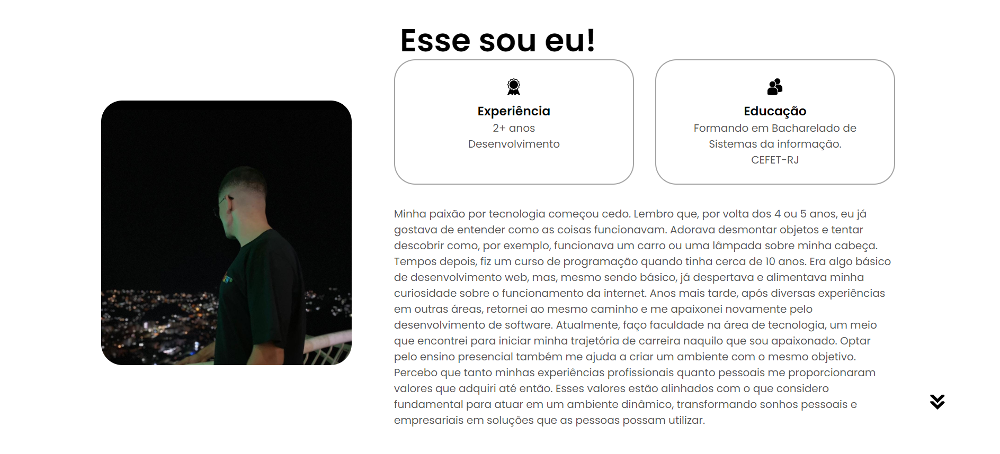
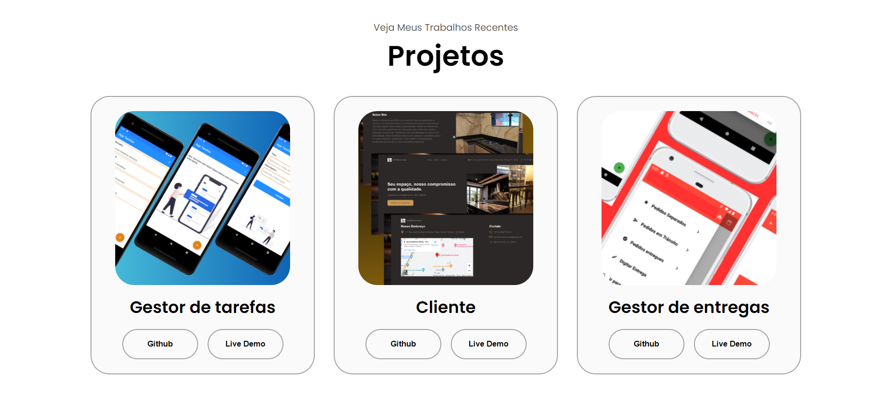

# Willian Fernandes Vieira Portfolio

Este é o repositório do meu portfólio pessoal, desenvolvido utilizando HTML, CSS e JavaScript.

## Visão Geral

Meu portfólio online apresenta várias seções, incluindo perfil, sobre mim, experiência, projetos e informações de contato. Foi criado com o objetivo de destacar minhas habilidades e projetos mais recentes.

## Capturas de Tela

### Perfil


### Sobre Mim



### Projetos



## Como Usar

Para visualizar o projeto localmente:

1. Clone este repositório:
   ```bash
   git clone https://github.com/willfevi/WillianDev.git
